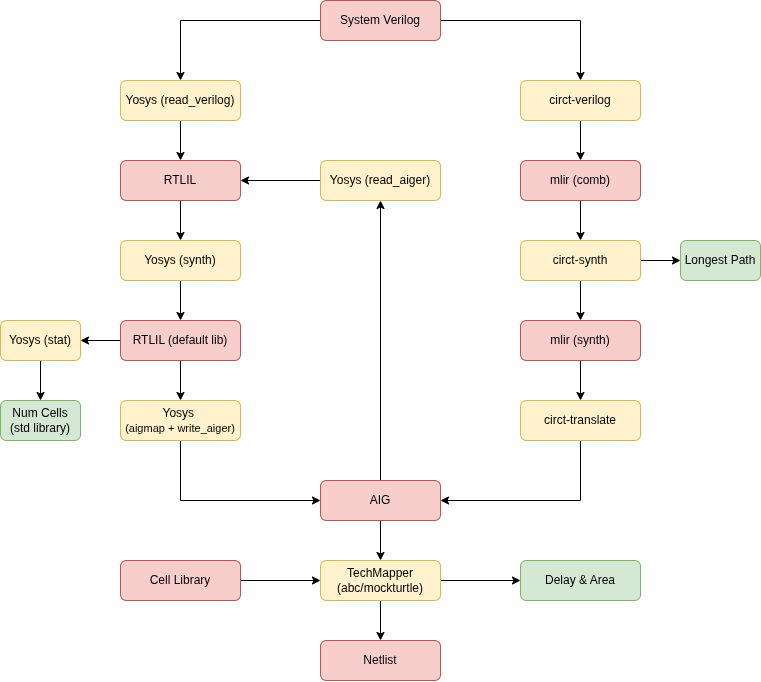

# DatapathBench
A collection of simple datapath circuit design and verification benchmarks. 
Each directory contains alternative (but equivalent) representations of a single module (named <dir\>):
* sv/<dir\>.sv - System Verilog representation
* mlir/<dir\>.comb.mlir - representation in [CIRCT Comb Dialect](https://circt.llvm.org/docs/Dialects/Comb/)
* mlir/<dir\>.datapath.mlir - optimised representation in [CIRCT Datapath Dialect](https://circt.llvm.org/docs/Dialects/)

Note that the .mlir representations do not support parameterisation 
therefore each file is a specific instatiation of the module.

## Evaluation
We provide a script for reporting the different flows shown in the picture below. Technology mapping will be added in the future.
Every evaluation must specify a bitwidth, and you can optionally specify a single benchmark to run. 
```
python3 eval_bench.py <bitwidth> [benchmark]
```
<p align="center"></p>

## Verification (WIP)
The verification challenge is to prove the equivalence of these represenatations. 
Example smtlib encodings are shared in the <dir\>/smtlib/ that prove
the equivalnce between <dir\>/mlir/<dir\>.comb.mlir and <dir\>/mlir/<dir\>.datapath.mlir (for the bitwidth specified in the .smt2 filename).


